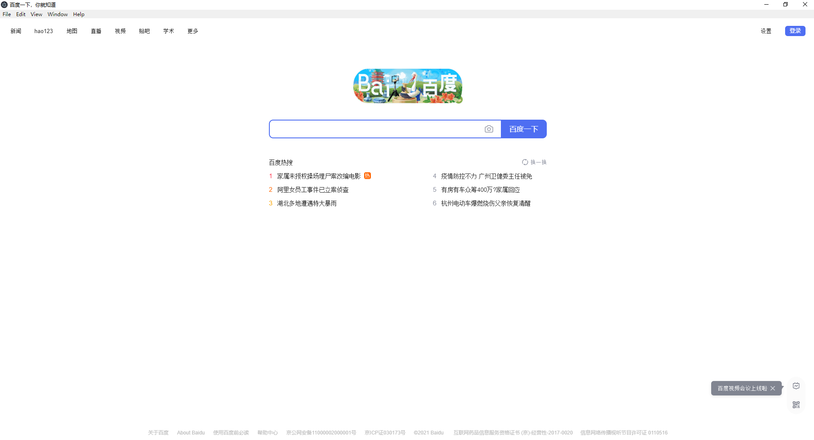

# Electron Samples

样品电子应用和进一步的想法。

## 开始

首先要做的是安装Node.js，如果你还没有安装的话。最简单的
方法是访问[nodejs.org](https://nodejs.org)并下载
安装程序，它将为你设置' node '和' npm '。

一旦解决了这个问题，就克隆存储库。如果你是新手
少不更事的人，看看
[克隆存储库指南](https://help.github.com/articles/cloning-a-repository/)。

```sh
git clone https://github.com/electron/simple-samples
```

每个文件夹都包含一个不同的应用程序和它自己的README。md的文件
解释它能做什么，如何运行，以及如何改进。

这里有好几个程序，需要进入具体的文件夹，执行编译和运行。
可参考这个地址，运行效果图在这个URL也有  
https://www.electronjs.org/blog/simple-samples


### url 
在窗口的命令行中加载传递的URL。

```sh
cd url
npm install
npm start http://wwww.baidu.com
```



## 警告

这个存储库是用来学习电子的工具
现有的应用程序进一步使用额外的电子api。

它是为那些不仅是新电子的人，但
这对web开发来说也有点新鲜。考虑到这一点，我们使用了“平易近人”
像jQuery和Bootstrap这样的工具可以将进入门槛保持在最低
可能的。

## 链接

- [Electron docs](http://electron.atom.io/docs/all)
- [Node.js docs](https://nodejs.org/docs/latest/api/all.html)
- [Electron repository](https://github.com/electron/electron)
